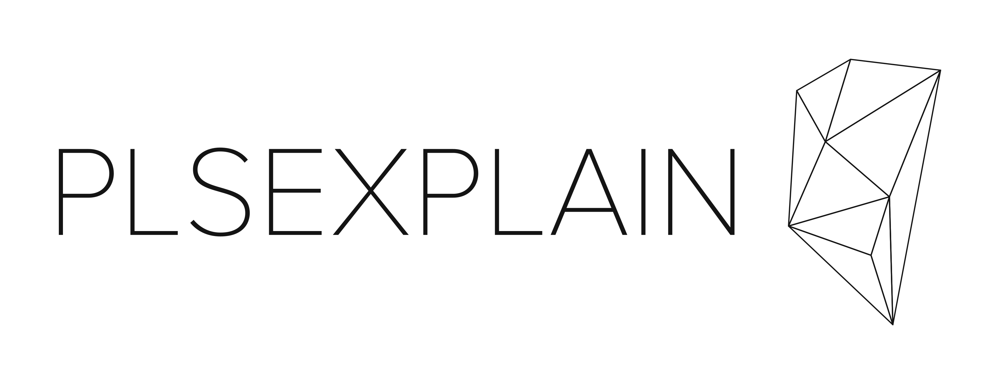

---

Create an explainable AI dashboard for your machine learning model. plsexplain,
or please, explain is a question that you may want to ask your computer after
you've trained a machine learning model.

---

[](https://pypi.org/project/plsexplain/)
[](https://pypi.org/project/plsexplain/)
[](https://github.com/wmeints/plsexplain/actions/workflows/ci.yml)

## Getting started

You can install this tool as a python package on your machine by using the
following command in your favorite shell:

```shell
pip install plsexplain
```

After you've installed the package, use the following command to get an
explainable AI dashboard for your trained model:

```shell
plsexplain <path-to-model> <path-to-sample-set>
```

Currently, we support models trained with scikit-learn, but we're planning on
supporting tensorflow and pytorch as well.

The sample set, is a small dataset containing samples you want to use in the
dashboard for explanations based on sample data. We only support using
CSV files at the moment.

## Documentation

Please refer to the documentation for more information on how to use the tool
for various types of models and sample datasets.

[📖 Read the documentation][DOCUMENTATION]

## Contributing

We welcome contributions to this project. Please refer to the
developer guide for more information on how to submit
issues and pull requests for this project.

[🛠 Read the developer guide][CONTRIBUTOR_GUIDE]

## Code of conduct

Please make sure to follow our [code of conduct][CODE_OF_CONDUCT] when
interacting with other contributors on this project.

[CODE_OF_CONDUCT]: CODE_OF_CONDUCT.md
[CONTRIBUTOR_GUIDE]: https://wmeints.github.io/plsexplain/contributing/index.html
[DOCUMENTATION]: https://wmeints.github.io/plsexplain