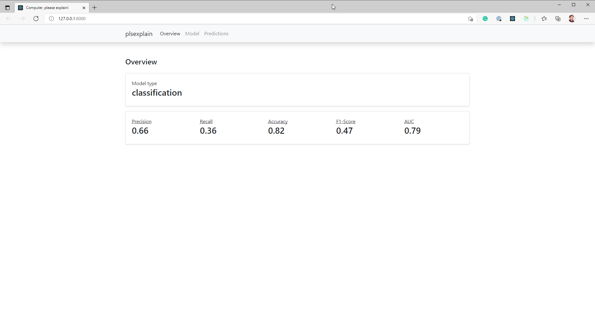
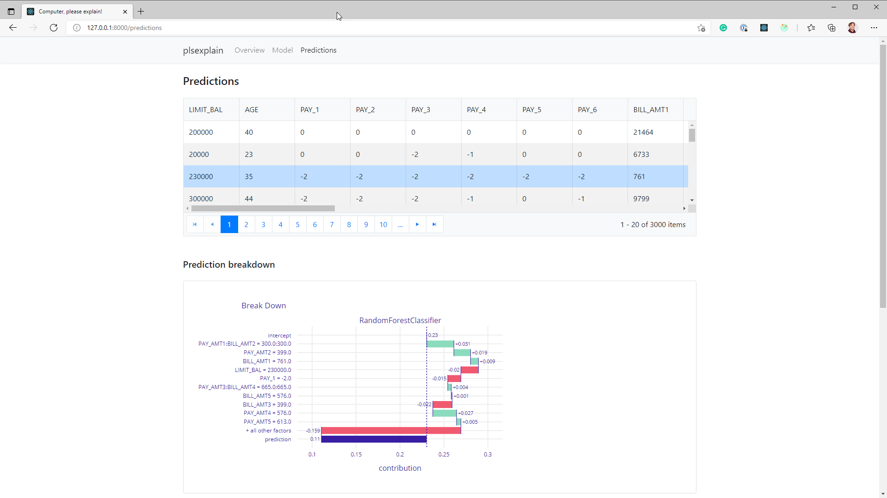

.. _package_overview:

================
Package overview
================

In this section we'll explore the basics of the plsexplain package. 
If you're looking for a more in-depth explanation we recommend reading the :ref:`user_guide`.

Command-line interface
----------------------

.. click:: plsexplain.cli:main
    :prog: plsexplain
    :nested: full

Features
--------

Performance metrics
^^^^^^^^^^^^^^^^^^^
When you first open the dashboard, you'll see the overview page with the performance metrics and some model metadata.
Depending on the type of model you'll see different metrics on this page.

Model explanations
^^^^^^^^^^^^^^^^^^
The tool can be used to generate model explanations. You can view the model explanations when you navigate to the
model navbar item at the top of the screen. You'll get a screen that looks similar to the sample below:

.. figure:: ../_static/dashboard-01.png
    :alt: Model explanations section on the dashboard

Prediction explanations
^^^^^^^^^^^^^^^^^^^^^^^
The tool can also be used to generate prediction explanations. You can view the prediction explanations when you select
the *Predictions* item in the navigation bar. You'll see a screen similar to the sample below:

