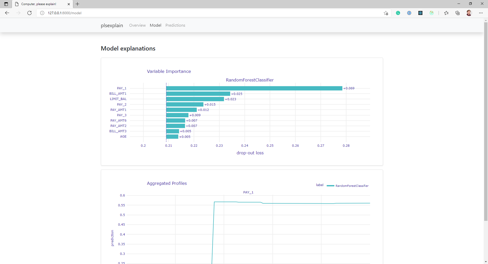

.. _model_explanations:

==================
Model explanations
==================

In this section, we discuss the model predictions. We’ll cover how to interpret the explanations given by the dashboard.

Permutation feature importance
------------------------------
The first explanation given by the dashboard is about feature importance. The feature importance plot tells you which 
features have the most impact on the performance of the model.

When you should use the feature importance
^^^^^^^^^^^^^^^^^^^^^^^^^^^^^^^^^^^^^^^^^^
The feature importance plot can be helpful when trying to fix a model that is overfitting, especially if you have a 
model that has many features and therefore has a high chance to overfit. The feature importance plot helps you in this 
scenario to decide which features to keep and which features to drop.

How to interpret the feature importance plot
^^^^^^^^^^^^^^^^^^^^^^^^^^^^^^^^^^^^^^^^^^^^
Let’s take a look at an example feature importance plot to understand how to interpret it. The sample below shows a version of the plot:

The plot shows bars for each of the features and their impact on the performance of the model. Each bar shows the
difference in performance when that feature is changed.

To better understand the values shown in the plot, we’ll have to look at the algorithm used to develop the values in 
the plot.

We perform the following steps to calculate the feature importance:

1. First, a metric is chosen and calculated to determine the performance of the model. We calculate accuracy for 
   classification models. For regression models, we calculate the mean squared error rate. 
2. Then, one-by-one the features are permutated, and we calculate the performance metric again. 
3. Finally, we calculate the difference between the new performance metric and the original one we calculated in the 
   first step is the feature importance.

.. _Permutation Feature Importance: https://christophm.github.io/interpretable-ml-book/feature-importance.html
.. _Accumulated Local Effects: https://christophm.github.io/interpretable-ml-book/ale.html
.. _RMSE metric: https://en.wikipedia.org/wiki/Root-mean-square_deviation
